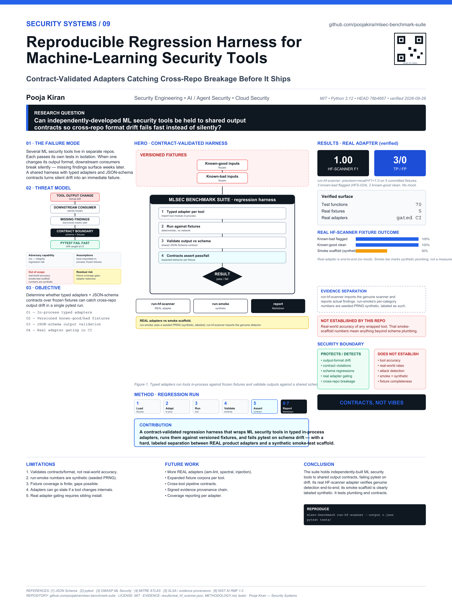

# mlsec-benchmark-suite

<!-- security-systems-poster -->
## Research Poster

**Security Systems / 09 — Reproducible Regression Harness for Machine-Learning Security Tools**

[](poster/poster_36x48.pdf)

> Technical research poster (36 x 48 in). Click the image for the print-resolution **[PDF](poster/poster_36x48.pdf)**.
> Poster measurements are dated snapshots at their printed commits. Use the repository evidence files for newer results; do not read the poster as a verification of the latest `main`.
> Every metric on it is evidence-backed; historical/projected numbers are labeled and separated from current results.
> Part of the *Pooja Kiran - Security Systems* engineering poster collection.
<!-- security-systems-poster -->


**Maintainer:** Pooja Kiran ([@poojakira](https://github.com/poojakira))

## Overview

`mlsec-benchmark-suite` is a cross-repo regression harness. It wraps each ML security tool in a typed Python adapter, imports it in-process against frozen fixtures, and validates outputs against a shared JSON schema so contract drift between tools fails `pytest` immediately. It exists because tools that each pass in isolation can still break each other when one changes its output format.

## Verified Snapshot

Reproduced on current `main` (Python 3.12).

| Metric | Current verified result |
|---|---:|
| Tests | 70 collected — 69 passed, 1 skipped (real-detector test, needs hf-scanner) |
| With hf-scanner installed | 70 passed |
| Adapters | typed, in-process, schema-validated |
| Signing | Ed25519 sign/verify + dataset checksum |

## Security Problem

A portfolio of independently maintained security tools has an integration risk: when one tool changes its output format, downstream tools that consume it break silently, and missing findings may not surface for weeks. This suite validates every tool's output against a shared contract on every run, so cross-repo breakage is caught before it ships.

## Threat Model & Scope

**In scope:** in-process regression/contract testing of sibling tool adapters against versioned fixtures; Ed25519 signing and dataset-checksum verification of benchmark artifacts.

**Out of scope / not claimed:** It is a regression harness, not a security scanner itself. Sibling modules are mocked for unit tests, so the suite is green with no sibling tools installed; the one real-detector test is skipped without hf-scanner. Fixture results are contract checks, not real-world detection rates.

## Architecture

```text
Versioned fixtures  -->  typed per-tool adapters (in-process import)
      |
      v
Shared JSON output schema validation
      |
      v
pytest pass/fail  +  Ed25519-signed benchmark artifacts (tamper/wrong-key detection)
```

## Core Capabilities

- Typed in-process adapters for sibling ML security tools
- Shared JSON-schema contract validation across tools
- CLI dispatch with clean-error exit codes; aggregate + partial-failure handling
- Trend/regression analysis and Ed25519 sign/verify + dataset checksum verification

## How It Works

- Typed adapters import each tool's Python module in-process
- Versioned fixtures provide known-good and known-bad inputs
- Contracts define expected pass/fail behavior per fixture
- JSON Schema validation ensures output format consistency
- A single `pytest` run exercises all adapters; the `report` subcommand renders Markdown summaries

Adding a new tool means writing one adapter file and dropping fixtures into the right directory. No infrastructure changes needed.

---

## REAL adapters vs. the smoke-test scaffold

This repo contains two clearly separated kinds of benchmark output. Do not confuse them.

- **`run-smoke` is a deterministic smoke-test scaffold.** It uses a seeded PRNG
  (`random.Random(seed)`) to exercise the result schema, provenance fields, and
  signing workflow. Its per-category numbers are **synthetic** and are labeled as
  such — they are not measurements of any detector. It exists to test the
  *plumbing* (schema, contracts, evidence signing), not tool accuracy.

- **`run-hf-scanner` is a REAL product adapter.** It imports the genuine
  `scanner.analyzer.config_scanner.analyze_config_file` from
  [`hf-model-provenance-scanner`](https://github.com/poojakira/hf-model-provenance-scanner),
  feeds it the raw contents of the committed fixtures in `fixtures/hf_configs/`,
  and reports the detector's actual findings — no PRNG, no hand-written numbers.

**Verified real run** (Python 3.12, `hf-scanner` editable install, 5 committed
fixtures — 3 known-bad, 2 known-good):

```text
$ mlsec-benchmark run-hf-scanner --output results/real_hf_scanner.json
HF scanner benchmark complete: precision=1.0, recall=1.0, f1=1.0
```

All 3 known-bad configs are flagged by the scanner's real `HFS-024` rule (URL in a
non-standard config field) and both known-good configs produce zero findings
(`total_tp=3, total_fp=0, total_fn=0`). This is asserted end-to-end (no mock) by
`tests/test_hf_scanner_adapter.py::test_real_scanner_detects_all_bad_and_no_false_positives`,
which is skipped automatically when the sibling scanner is not installed and is
run as a gating CI job (`real-adapter`) that installs the real sibling from git.

The other adapters (`run-iam-lint`, `run-prompt-injection`, `run-spectral`) are
real in-process adapters too, but their sibling tools are optional; their unit
tests use mocks so `pytest tests/` stays green with no siblings installed.

### Evidence integrity: verifiable signatures + dataset checksums

- **Ed25519 public-key signing** — `mlsec-benchmark keygen-ed25519`, `sign`, and
  `verify` produce and check signatures that a third party can verify with the
  **public key alone** (no shared secret). This addresses the prior HMAC
  limitation where results could only be verified by whoever held the secret.
  Verified locally: `signature OK (ed25519)`. Tampering with any signed field or
  using the wrong public key makes `verify` fail (exit 2). Signing keys (`*.pem`)
  are git-ignored. `cryptography` is a dev-only, lazily imported dependency, so
  the core `run-smoke`/`validate` runtime keeps zero required third-party deps.
- **Dataset checksums** — `datasets/hf-scanner-fixtures.json` pins the SHA-256 of
  every committed HF fixture. `mlsec-benchmark verify-dataset` recomputes and
  compares them, and `run-hf-scanner` runs the same gate automatically before
  scoring, so a modified fixture aborts the run instead of scoring against
  unexpected data. Verified locally: `dataset checksums OK`.

---

## Architecture Overview

```
+------------------+     +------------------+     +------------------+
|   CLI / pytest   |---->|    Adapters (4)   |---->|  Tools Under Test |
|   entrypoint     |     |  typed wrappers   |     |  (sibling repos)  |
+------------------+     +------------------+     +------------------+
        |                        |
        v                        v
+------------------+     +------------------+
|    Contracts     |     |  Versioned       |
|  (expected       |     |  Fixtures        |
|   pass/fail)     |     |  (known inputs)  |
+------------------+     +------------------+
        |                        |
        v                        v
+------------------+     +------------------+
|  JSON Schema     |     |  Results (JSON)  |
|  Validation      |     |  + MD Reports    |
+------------------+     +------------------+
        |
        v
+------------------+
|    Dashboard     |
|  (GitHub Pages)  |
+------------------+
```

Component responsibilities:

| Component | What it does |
|-----------|-------------|
| `mlsec_benchmark_suite/adapters/` | Typed Python wrappers (one per tool) that import each tool's Python module in-process and normalize the output into a common structure. Each adapter is roughly 8-9 KB of focused integration code. |
| `mlsec_benchmark_suite/cli.py` | CLI entrypoint (`mlsec-benchmark` / `python -m mlsec_benchmark_suite`) exposing `run-smoke`, `run-all`, `run-iam-lint`, `run-hf-scanner`, `run-prompt-injection`, `run-spectral`, `validate`, `report`, and `build-index` subcommands. |
| `contracts/portfolio-smoke-v1.json` | Declares which fixtures should pass and which should fail for each adapter. This is the source of truth for expected behavior. |
| `fixtures/` | Versioned input files (IAM policy JSON, HuggingFace model configs, prompt strings, poisoned datasets) that tools are tested against. |
| `schemas/result.schema.json` | JSON Schema that every adapter output must validate against. Enforces structural consistency across the portfolio. |
| `results/` | Structured JSON output from each benchmark run. Machine-readable for downstream analysis. |
| `reports/` | Generated Markdown reports for human review (via the `report` subcommand). |
| `dashboard/` | Static HTML page served via GitHub Pages for at-a-glance status. |
| `datasets/` | Fixture set manifests describing which inputs belong to which test suites. |
| `tests/` | 70 test functions across 8 test modules covering all adapters, CLI, integration, Ed25519 signing, and dataset checksum verification. |

---

## End-to-End Workflow: How Benchmarks Run

1. **Invoke**: You run `pytest tests/ -q` or a CLI benchmark such as `python -m mlsec_benchmark_suite run-smoke ...`. The CLI (or pytest) discovers all registered adapters.

2. **Load contracts**: The runner reads `contracts/portfolio-smoke-v1.json` to determine which fixtures to feed each adapter and what the expected outcome should be (pass or fail).

3. **Execute adapters**: Each adapter imports its corresponding tool's Python module in-process (e.g., `iam_lint_adapter` imports `aws_agent_identity_guard`) and runs it against the appropriate fixture files from `fixtures/`.

4. **Capture output**: The adapter normalizes the tool's structured return value into a common JSON result object.

5. **Validate schema**: Each result is validated against `schemas/result.schema.json`. If the tool's output format has drifted, validation fails immediately.

6. **Check contract**: The result (pass/fail/findings count) is compared against the contract's expected behavior. A mismatch is a test failure.

7. **Write results**: Structured JSON goes to `results/`. The `report` subcommand renders a Markdown summary to `reports/`.

8. **CI gate**: In GitHub Actions, a non-zero exit code from pytest blocks the merge.

---

## Design Decisions and Trade-offs

**Adapters import each tool's Python module directly (in-process), not via subprocess.**
Why: every tool in this portfolio is a Python package, so the adapters `import` the
sibling package (e.g. `iam_lint_adapter` imports `aws_agent_identity_guard` and calls
`scan_policy_document`) rather than shelling out to a CLI. This is faster, gives typed
access to structured findings, and avoids brittle stdout parsing. The trade-off is that
each tool under test must be importable in the same environment: if a sibling package is
not installed, the adapter raises a clear error and the CLI exits with code 3
(`dependency unavailable`) rather than a traceback. Each adapter falls back to importing
from a sibling source checkout next to this repo when the package is not pip-installed.

**Contracts are separate JSON files, not inline assertions in test code.**
Why: Contracts need to be reviewable by non-developers (security leads, auditors). Keeping them in a declarative JSON format means they can be diffed, version-tracked, and validated independently of test logic. The cost is an extra layer of indirection when debugging a failure.

**Fixtures are checked into the repository, not generated on the fly.**
Why: Reproducibility. If a test fails, you need to know the exact input that caused it. Generated inputs introduce nondeterminism. The trade-off is repo size growth as fixtures accumulate, but for JSON/text fixtures this remains manageable.

**Single JSON Schema for all adapter outputs.**
Why: A shared schema forces structural consistency. Any consumer of benchmark results (dashboards, CI pipelines, audit logs) can parse output from any adapter without special-casing. This constrains what adapters can express but simplifies everything downstream.

**No runtime dependencies beyond the standard library.**
Why: The benchmark harness itself should be trivial to install and should never be the thing that breaks. Keeping it dependency-free (runtime) means it won't conflict with the tools it tests. Dev dependencies (pytest, ruff, numpy) are isolated to development and CI.

---

## Tech Stack

| Layer | Technology |
|-------|-----------|
| Language | Python 3.10+ |
| Test framework | pytest 8.2+ |
| Build system | setuptools 69+ with pyproject.toml |
| Linter | Ruff 0.8+ (E, F, I, W rules) |
| Dependency audit | pip-audit 2.7+ |
| Schema validation | JSON Schema (via `result.schema.json`) |
| CI/CD | GitHub Actions + Dependabot |
| Dashboard | Static HTML on GitHub Pages |

## Installation

```bash
# Clone the repository
git clone https://github.com/poojakira/mlsec-benchmark-suite.git
cd mlsec-benchmark-suite

# Create and activate a virtual environment
python -m venv .venv
source .venv/bin/activate        # Linux/macOS
# .venv\Scripts\activate         # Windows

# Install in development mode with all dev dependencies
pip install -e ".[dev]"
```

Prerequisites:
- Python 3.10 or later
- The unit-test suite (`pytest tests/`) runs fully with **no sibling tools installed** —
  adapter tests mock the sibling modules.
- Running a *live* per-adapter benchmark (`run-<adapter>`) requires that adapter's
  sibling package to be importable. Each is optional and only needed for its own command:

  | Command | Requires (Python import) | Sibling repo |
  |---------|--------------------------|--------------|
  | `run-iam-lint` | `aws_agent_identity_guard` | `aws-agent-identity-guard` |
  | `run-hf-scanner` | `scanner.analyzer.config_scanner` | `hf-model-provenance-scanner` |
  | `run-prompt-injection` | `mcp_monitor.detectors.prompt_injection` | `mcp-agent-security-gateway` |
  | `run-spectral` | `poison_detector.spectral` + `numpy` | `dataset-poisoning-detector` |

  If a required sibling is not installed, the command exits with code **3**
  (`dependency unavailable`) and a one-line install hint — no traceback.
  `run-smoke`, `validate`, `report`, and `build-index` need **no** sibling tools.

## Quick Start

```bash
# Run the full regression suite
pytest tests/ -q

# Run only the IAM adapter tests
pytest tests/test_iam_lint_adapter.py -v

# Run the deterministic smoke benchmark via the CLI entrypoint.
# run-smoke requires provenance metadata for the result record:
python -m mlsec_benchmark_suite run-smoke \
  --output results/smoke.json \
  --repository-commit abc123 \
  --artifact-digest sha256:deadbeef \
  --model-hash sha256:cafebabe \
  --dependency-lock-hash sha256:feedface

# Validate a result file against the JSON schema
python -m mlsec_benchmark_suite validate results/smoke.json

# Generate a markdown report from a result file
python -m mlsec_benchmark_suite report results/smoke.json --output reports/report.md
```

## Usage Examples

Run with timing to identify slow adapters:
```bash
pytest tests/ -v --durations=10
```

Run a single adapter's tests in isolation:
```bash
pytest tests/test_hf_scanner_adapter.py -v --tb=short
```

Use the installed CLI command directly (`mlsec-benchmark` is registered via `[project.scripts]`):
```bash
# Run all adapter benchmarks into one combined result file
mlsec-benchmark run-all --output results/combined.json

# Run a single adapter benchmark
mlsec-benchmark run-iam-lint --output results/iam_lint.json
mlsec-benchmark run-hf-scanner --output results/hf_scanner.json
mlsec-benchmark run-prompt-injection --output results/prompt_injection.json
mlsec-benchmark run-spectral --output results/spectral.json

# Validate, report, and index result files
mlsec-benchmark validate results/combined.json
mlsec-benchmark report results/combined.json --output reports/report.md
mlsec-benchmark build-index --results-dir results --output results/index.json
```

> **Which outputs feed `validate` / `report` / `build-index`.** These commands
> require the **full provenance schema** produced by `run-smoke` and the
> per-adapter `run-<adapter>` commands. The `run-all` command intentionally
> writes an **aggregate-only** record (combined per-adapter metrics, run id,
> environment) that omits the provenance fields, so `validate`/`report`/
> `build-index` will reject `run-all` output with `error: result missing
> fields: [...]` and exit code 2. `build-index` also validates *every* `*.json`
> in `--results-dir`, so point it at a directory containing only full-schema
> results. The examples above use `combined.json` for the command shape;
> substitute a `run-smoke` output for a run that actually validates.

See [RUNBOOK.md](RUNBOOK.md) for the full operational reference for every subcommand.

---

## Security Considerations

**Fixture safety**: Test fixtures in `fixtures/` include intentionally malicious inputs (overly permissive IAM policies, prompt injection strings, poisoned dataset samples). These are inert data files, but be aware they exist when reviewing diffs or granting repository access.

**Tool execution**: Adapters import the sibling tool's Python module and run it in-process. If a tool under test is compromised or misconfigured, its code executes with the permissions of the user running the benchmark, inside the same interpreter. Run benchmarks in isolated environments (containers, CI runners) rather than on production machines.

**No secrets in fixtures**: The IAM policy fixtures are synthetic. They do not reference real AWS accounts, ARNs, or credentials.

**Dependency management**: Dependabot is configured for automated security updates. The `pip-audit` dev dependency provides supply chain checks. The runtime has zero third-party dependencies, minimizing attack surface.

**Schema validation as a safety net**: Even if a tool produces unexpected output, the schema validation step will reject it before it's written to results, preventing malformed data from propagating to dashboards or audit logs.

---

## Evaluation Methods, Results, and Limitations

**How the suite evaluates tools:**
- Binary pass/fail against known-good and known-bad inputs
- Structural conformance of output to JSON Schema
- Contract adherence (expected findings count, expected verdict)
- Execution time monitoring (timeout detection)

**Current coverage:**

| Adapter | Fixtures | Test Functions |
|---------|----------|---------------|
| `iam_lint_adapter` | IAM policy JSON (valid + overprivileged) | Dedicated module |
| `hf_scanner_adapter` | HuggingFace model config files | Dedicated module |
| `prompt_injection_adapter` | Prompt strings (benign + malicious) | Dedicated module |
| `spectral_adapter` | Poisoned dataset samples | Dedicated module |
| Cross-adapter integration | All fixture types | `test_run_all.py` |
| CLI interface | Subcommand invocations | `test_cli.py` |
| Ed25519 signing + dataset integrity | Keygen/sign/verify, tamper detection, checksum verification | `test_signing_and_dataset.py` |

Total: 70 test functions across 8 test modules.

**Limitations:**
- The suite tests tools against static, curated fixtures. It does not measure real-world detection rates or false positive rates on production data.
- Adapters import tools in-process, so a failure could be a tool bug or an environment issue (sibling package not installed, wrong version). A missing sibling is reported distinctly (exit 3, `dependency unavailable`); other failures surface the underlying error.
- Contract-based testing only catches regressions from previously defined behavior. Novel failure modes require new fixtures and updated contracts.
- No performance benchmarking beyond timeout detection. Execution time variability across environments means timing assertions would be flaky.

---

## Release Readiness Assessment

| Criterion | Status | Notes |
|-----------|--------|-------|
| Automated CI | Yes | GitHub Actions workflow + Dependabot |
| Test coverage | 70 test functions across 8 modules, all 4 adapters exercised | No coverage gaps in adapter layer |
| Schema validation | Enforced on every run | Catches output drift automatically |
| Contract versioning | `portfolio-smoke-v1.json` | Versioned filename allows schema evolution |
| Dependency hygiene | Zero runtime deps, pip-audit in CI | Minimal supply chain risk |
| Documentation | README, RUNBOOK, inline contracts | Operational playbook exists |
| Dashboard | GitHub Pages static site | At-a-glance visibility |
| Error handling | Clean exit codes, no tracebacks on expected failures | Missing sibling tool → exit 3; bad schema / existing output → exit 2; `run-all` isolates per-adapter failures |

**What's missing for full production use:**
- No published releases or changelog (main-only, no tags)
- No container image for hermetic execution
- No performance regression tracking over time
- Limited to 4 adapters; adding new tools requires manual adapter development

---

## Roadmap and Future Improvements

- **Container-based execution**: Package the suite and all tools into a Docker image so benchmarks run identically in any environment.
- **Performance tracking**: Store timing data per run and alert on regressions (e.g., adapter X suddenly takes 3x longer).
- **Adapter generator**: Scaffold new adapters from a template to reduce onboarding time for new tools.
- **Fuzzing mode**: Complement static fixtures with property-based testing to discover unexpected failure modes.
- **Result history and trending**: Persist results across runs for time-series analysis of pass rates and findings counts.
- **Broader fixture coverage**: Add edge cases (empty inputs, extremely large policies, unicode in prompts) to exercise adapter error handling.
- **Release automation**: Tag versions, publish to PyPI, maintain a changelog.

---

## References

- [RUNBOOK.md](https://github.com/poojakira/mlsec-benchmark-suite/blob/main/RUNBOOK.md) - Operational guide for running and extending benchmarks
- [JSON Schema Specification](https://json-schema.org/) - Foundation for output validation
- [pytest Documentation](https://docs.pytest.org/) - Test framework used by this suite
- [aws-agent-identity-guard](https://github.com/poojakira/aws-agent-identity-guard) - IAM policy linting tool tested by this suite
- [GitHub Pages Dashboard](https://poojakira.github.io/mlsec-benchmark-suite/) - Live status dashboard

---


## Additional Documentation

- [INCIDENT_RUNBOOK.md](INCIDENT_RUNBOOK.md) - benchmark infrastructure incident response
- [docs/CONTINUOUS_TRACKING.md](docs/CONTINUOUS_TRACKING.md) - how continuous trend tracking works
- [mlsec_benchmark_suite/tracker.py](mlsec_benchmark_suite/tracker.py) - trend analysis and regression detection

## License and Author

**License**: Apache-2.0

**Author**: Pooja Kiran

```
Copyright 2024 Pooja Kiran

Licensed under the Apache License, Version 2.0 (the "License");
you may not use this file except in compliance with the License.
You may obtain a copy of the License at

    http://www.apache.org/licenses/LICENSE-2.0
```

---

## Engineering Lessons

The most useful testing infrastructure is the kind that tests the boundaries between systems, not just the systems themselves. Every tool in this portfolio had passing unit tests. What none of them had was a way to verify they still agreed on a shared contract. Building that verification layer took less code than any individual tool's test suite, but it caught more integration bugs than all of them combined. The key insight: treat tool output schemas the way you treat API contracts. Version them, validate them automatically, and break the build when they drift.

<!-- repo-verification:start -->
## Verification update — 2026-09-30

- **Scope:** Account-wide `poojakira` repository pass covering source/configuration, CI/release workflows, security-hygiene gates, dependency/SAST controls, and documentation consistency.
- **Remediation:** Pinned the CI workflow actions to immutable revisions while preserving signing and benchmark evidence generation.
- **Verification state:** CI, Production Gate, Security Hygiene, and Documentation Integrity completed successfully after the hardening commit.
- **Security note:** Benchmark scores are reproducible test evidence and should not be described as production guarantees.
- **Evidence boundary:** This update records repository and GitHub Actions evidence observed during the pass. It is not a claim of independent penetration testing, production deployment, or zero residual risk.
<!-- repo-verification:end -->

## Verification checkpoint — 2026-09-30

- **Snapshot commit:** `8134ea47252e5e7161dcbfc0daf5a9bd1dc3c6c0`
- **Status:** VERIFIED GREEN
- **Evidence:** Security Hygiene, Documentation Integrity, Production Gate, and CI all completed successfully on the current main revision.
- This checkpoint is intentionally date-bounded. It does not claim zero vulnerabilities or universal production readiness.


## Secret handling

Keep runtime credentials outside Git. If this repository provides an `.env.example` or `.env.sample`, copy it to a local `.env` or `.env.local` and fill in values locally; the real environment file must remain untracked.

Do not commit AWS access keys or session credentials, API tokens, service-account JSON, private keys, package-manager credentials, Terraform state, or secret-bearing `tfvars`. CI/deployment credentials belong in GitHub Actions secrets or the deployment provider's secret manager. AWS account IDs are identifiers; AWS access-key IDs, secret access keys, and session tokens are credentials.

If a real credential is ever exposed, revoke or rotate it at the provider first, then remove it from the working tree and reachable Git history. The Security Hygiene workflow checks the current tree and reachable history for common credential formats without printing matched secret values.

## Security review

See [the dated security review](SECURITY_AUDIT_2026-09-30.md) for concrete fixes, verification and deployment limits.

Keep your own credentials in an ignored local `.env` or your deployment secret store. Copy placeholder values from `.env.example` only when that file exists, and supply API keys from your own provider accounts. Never commit actual keys or use test/example keys in a deployed service. Ignore rules do not remove secrets already committed; revoke exposed keys at the provider and review history separately.

<!-- security-local-config:start -->
## Secrets and local configuration

- Never commit real API keys, access tokens, passwords, cloud credentials, private keys, or a populated `.env` file.
- Local `.env` and `.env.*` files are ignored by Git. Only safe templates such as `.env.example` or `.env.sample` may be committed, and they must contain placeholder or empty values only.
- If an integration needs credentials, create your own local `.env` file (or use your shell/secret manager) and supply **your own** API key. In GitHub Actions, use repository/environment secrets rather than hard-coding values in workflow YAML.
- Do not copy or reuse any credential that appears in repository history, examples, tests, screenshots, logs, or documentation. Test strings are not intended to be usable credentials.
- If a real credential is ever committed, **revoke or rotate it at the credential provider first**, then remove it from the current tree and reachable Git history. Deleting a key from GitHub does not revoke it.
<!-- security-local-config:end -->
